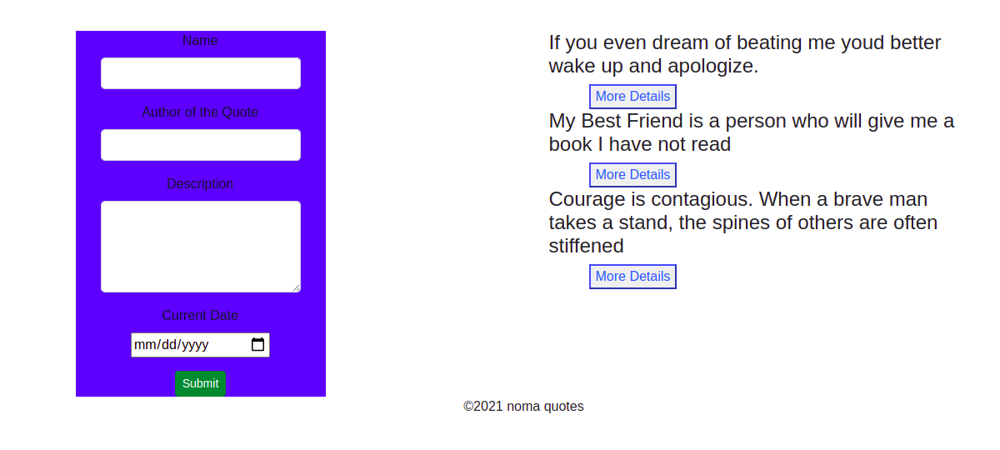

# nomaQuote

#### nomaQuote is an quote  generator created using angular cli  v.12.2.8
#### By Simon Kairu Mureithi
## Description
nomaquote is an app generator where people can write their favourite quotes and people vote which is the best quote 
## Setup/Installation Requirements
The project is under the MIT licence making it easy for anyone who wants to use it,you can clone it to your machine

Open your terminal command prompt for windows.
Change the current working directory to the location where you want the cloned directory ie Desktop,Documents ets.
Type $ git clone then paste https://github.com/simonkairu/nomaQuote.git
Enter to create your local clone.
This will clone the repositoty into your local folder in your laptop.
You can then run it using any code editor that you like
## Known Bugs
There are currently no known bugs contact incase you get any
## Technologies Used
1 HTML(Hypertext Mark-up Language)

2 CSS 

3 Bootstrap

4 javascript

5 Git

6 Angular cli

7 Typescript
## Support and contact details
Incase of any support or any idea on how the website can be improved kindly email  simonkairu14@gmail.com or call 0702027760

### [live link](https://simonkairu.github.io/nomaQuote/)

### This project is under [LICENSE](MIT)

Copyright (c) {2021} Simon Kairu
